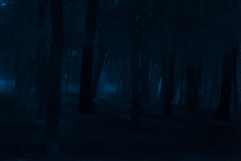
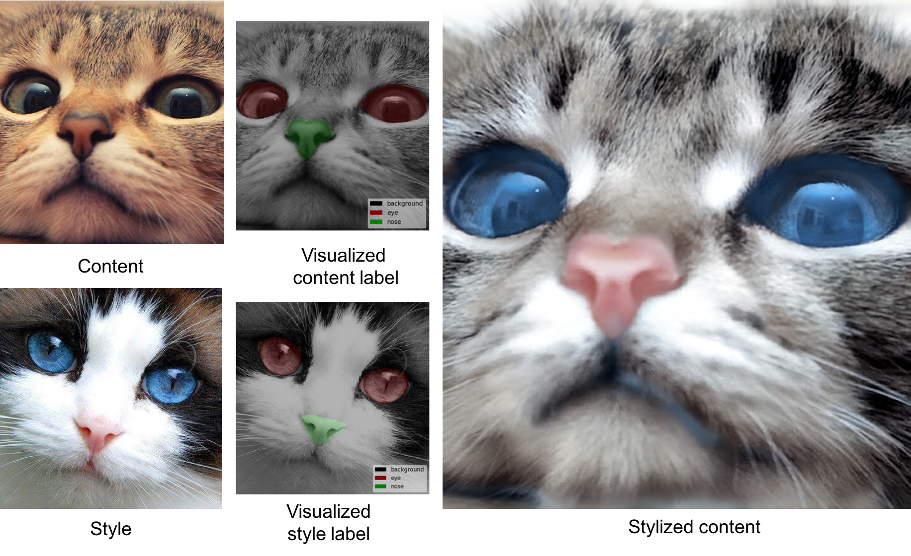

[](https://raw.githubusercontent.com/NVIDIA/FastPhotoStyle/master/LICENSE.md)


## CODE USAGE

### License
Copyright (C) 2018 NVIDIA Corporation.  All rights reserved.
Licensed under the CC BY-NC-SA 4.0 license (https://creativecommons.org/licenses/by-nc-sa/4.0/legalcode).


### Setup

We only tested our code in the following environment. 
- OS: Ubuntu 16.04
- CUDA: 9.1
- **Python 2 from Anaconda2**
- pytorch 0.3.0
- Setup environment variables. You might already have them set up properly.
  - export ANACONDA=PATH-TO-YOUR-ANACONDA-LIBRARY
  - export CUDA_PATH=/usr/local/cuda
  - export PATH=${ANACONDA}/bin:${CUDA_PATH}/bin:$PATH
  - export LD_LIBRARY_PATH=${ANACONDA}/lib:${CUDA_PATH}/bin64:$LD_LIBRARY_PATH
  - export C_INCLUDE_PATH=${CUDA_PATH}/include
- Install requirement
  - `sudo apt-get install -y axel imagemagick` (Only used for demo)
  - `conda install pytorch=0.3.0 torchvision cuda90 -y -c pytorch`
  - `pip install scikit-umfpack`
  - `pip install -U setuptools`
  - `pip install cupy`
  - `pip install pynvrtc`

### Download pretrained networks

**PyTorch models**

These models are extracted from Torch7 models and currently used in the project.

- Pull them from the `PhotoWCTModels` submodule: `git submodule update --init --recursive`

**Original Torch7 models**

Manually download the model files.
- Download pretrained networks via the following [link](https://drive.google.com/open?id=1ENgQm9TgabE1R99zhNf5q6meBvX6WFuq).
- Unzip and store the model files under `models`.

Automatically downloads pretrained networks and unzips them.
- Requires requests (`pip install requests`)
- `bash download_models.sh`

`converter.py` shows how to convert Torch7 models to PyTorch models.

### Example 1: Transfer the style of a style photo to a content photo.
- Create image and output folders and make sure nothing is inside the folders. `mkdir images && mkdir results`
- Go to the image folder: `cd images`
- Download content image 1: `axel -n 1 http://freebigpictures.com/wp-content/uploads/shady-forest.jpg --output=content1.png`
- Download style image 1: `axel -n 1 https://vignette.wikia.nocookie.net/strangerthings8338/images/e/e0/Wiki-background.jpeg/revision/latest?cb=20170522192233 --output=style1.png`
- These images are huge. We need to resize them first. Run
  - `convert -resize 25% content1.png content1.png`
  - `convert -resize 50% style1.png style1.png`
- Go back to the root folder: `cd ..`
- Test the photorealistic image stylization code `python demo.py`
- You should see an output image like



### Example 2: Transfer the style of a style photo to a content photo with semantic label maps.

By default, our algorithm performs the global stylization. In order to give users control to decide the content–style correspondences for better stylization effects, we also support the spatial control through manully drawing label maps. 

#### Prepare label maps

- Install the tool [labelme](https://github.com/wkentaro/labelme) and run the following command to start it: `labelme`
- Start labeling regions (drawing polygons) in the content and style image. The corresponding regions (e.g., sky-to-sky) should have the same label.
- The labeling result is saved in a ".json" file. By running the following command, you will get the `label.png` under `path/example_json`, which is the label map used in our code. `label.png` is a 1-channel image (usually looks totally black) consists of consecutive labels starting from 0.

```
labelme_json_to_dataset example.json -o path/example_json
```  

#### Stylize with label maps

```
python demo.py \
   --content_image_path PATH-TO-YOUR-CONTENT-IMAGE \ 
   --content_seg_path PATH-TO-YOUR-CONTENT-LABEL \ 
   --style_image_path PATH-TO-YOUR-STYLE-IMAGE \ 
   --style_seg_path PATH-TO-YOUR-STYLE-LABEL \ 
   --output_image_path PATH-TO-YOUR-OUTPUT
```

Below is a 3-label transferring example (images and labels are from the [DPST](https://github.com/luanfujun/deep-photo-styletransfer) work by Luan et al.):



### Docker image

We also provide a docker image for testing the code. 

  1. Install docker-ce. Follow the instruction in the [Docker page](https://docs.docker.com/install/linux/docker-ce/ubuntu/#install-docker-ce-1)
  2. Install nvidia-docker. Follow the instruction in the [NVIDIA-DOCKER README page](https://github.com/NVIDIA/nvidia-docker).
  3. Build the docker image `docker build -t your-docker-image:v1.0 .`
  4. Run an interactive session `docker run -v YOUR_PATH:YOUR_PATH --runtime=nvidia -i -t your-docker-image:v1.0 /bin/bash`
  5. `cd YOUR_PATH`
  6. `./demo.sh`

## Acknowledgement

- We express gratitudes to the great work [DPST](https://www.cs.cornell.edu/~fujun/files/style-cvpr17/style-cvpr17.pdf) by Luan et al. and their [Torch](https://github.com/luanfujun/deep-photo-styletransfer) and [Tensorflow](https://github.com/LouieYang/deep-photo-styletransfer-tf) implementations.
