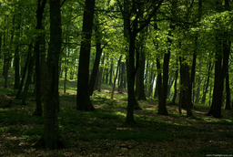
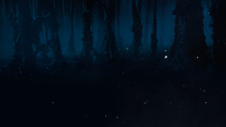
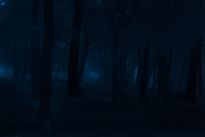

### License
Copyright (C) 2018 NVIDIA Corporation.  All rights reserved.
Licensed under the CC BY-NC-SA 4.0 license (https://creativecommons.org/licenses/by-nc-sa/4.0/legalcode).


### Step 1: Setup environment and install required libraries

- OS: Ubuntu 16.04
- CUDA: 9.1
- Python: Anaconda2
- Python Library Dependency
  1. `conda install pytorch torchvision cuda90 -y -c pytorch`
  2. `conda install -y -c menpo opencv3`
  3. `conda install -y -c anaconda pip`
  4. `pip install scikit-umfpack`
  5. `pip install cupy`
  6. `pip install pynvrtc`

### Step 2: Download pretrained networks

- Download pretrained networks via the following [link](https://drive.google.com/open?id=1ENgQm9TgabE1R99zhNf5q6meBvX6WFuq).
- Unzip and store the model files under models

### Step 3: Download example images

- Go to the image folder: `cd images`
- Download content image 1: `axel -n 1 http://freebigpictures.com/wp-content/uploads/shady-forest.jpg --output=content1.png`
- Download style image 1: `axel -n 1 https://vignette.wikia.nocookie.net/strangerthings8338/images/e/e0/Wiki-background.jpeg/revision/latest?cb=20170522192233 --output=style1.png`
- These images are huge. We need to resize them first. Run
  - `convert -resize 25% content1.png content1.png`
  - `convert -resize 50% style1.png style1.png`
- Go to the root folder: `cd ..`

- Content image



- Style image



### Step 4: Test the photorealistic image stylization code

- `python demo.py`

- Stylized content image



### Label map

By default, our algorithm performs the global stylization. In order to obtain a better result or give users control to decide the content–style correspondences, we also support the spatial control through manully drawing semantic label maps. 

- Install the tool [labelme](https://github.com/wkentaro/labelme) and run the following command to start it:

```
labelme
``` 

- Start labeling regions in the content& style image. The corresponding regions (e.g., sky-to-sky) should have the same label.

- The labelling result is saved in a ".json" file. Run the following command and get the "label.png" in "path/example_json". "label.png" is a 1-channel image (usually looks totally black) consists of consecutive labels starting from 0. You can also get a visualized reuslt "label_viz.png".

```
labelme_json_to_dataset example.json -o path/example_json
```  


## Acknowledgement

- We express gratitudes to the great work [DPST](https://www.cs.cornell.edu/~fujun/files/style-cvpr17/style-cvpr17.pdf) by Luan et al. and their [Torch](https://github.com/luanfujun/deep-photo-styletransfer) and [Tensorflow](https://github.com/LouieYang/deep-photo-styletransfer-tf) implementations.
